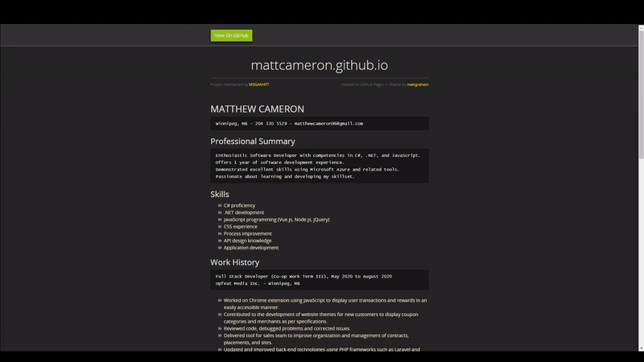
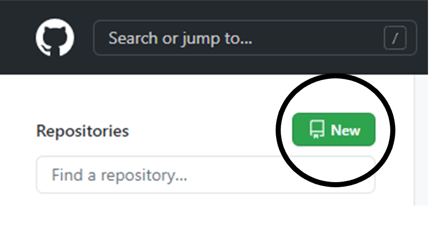
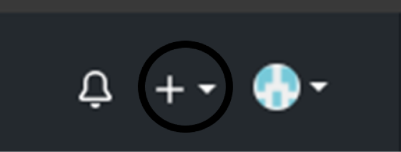

# Hosting a Resume on GitHub Pages

## Purpose
This should explain the practical steps of how to host a resume online using Markdown, GitHub Pages, and Jekyll. Additionally, there should be understandable links to the general principles of current Technical Writing according to Andrew Etter's book *Modern Technical Writing*.

## Outline
- [Prerequisites](#prerequisites)
- [Instructions](#instructions)
- [More Resources](#more-resources)
- [Authors and Acknowledgements](#authors-and-acknowledgements)
- [FAQs](#faqs)

## Prerequisites
You will need:
- A resume formatted in Markdown
    - This is important because the website will translate your file from Markdown.
- A GitHub account
    - You will need this in order to create and modify a repository.
- Basic knowledge of GitHub
    - In order to complete some of these steps, you will have to understand some of how GitHub works.

## Instructions

1. Creating GitHub repository

    1. Create a new *public* repository on GitHub named *username*.github.io (where *username* is your username). There are two ways that this can be done:
        -  Click the green 'New' button on the homepage   
           
        -  Click the '+' button located at the top right and select 'New repository'.   
            

> Git is being used here because it is a distributed version control system (DVCS) that is both powerful and easy to use. GitHub allows files to be hosted and modified all in one place. One very important feature is the ability to see edits to files and the differences from previous versions. This is core to version control systems and GitHub allows you to see individual commits for as much precision as possible. In Andrew Etter's words: "Version control systems like Git do an amazing job tracking changes over time." 

2. Adding Resume to GitHub
    1. Name your resume file `index.md`. (It must be **exactly** this name) 
    2. Add your resume to the root of your GitHub repository. This can be done via 'Add file' on the repository webpage:  
        

> Markdown is being used here because it is a lightweight markup language. Also, it is the most used due to its readability, access, and simplicity. Furthermore, it makes the process of putting content on a webpage much easier. Languages like Markdown are often easily converted to HTML, and then processed in order to display content on a browser. Instead of dealing with creating and then converting a Word document, Markdown can be displayed without much hassle. 

3. Building your Pages site
    1. Click over to the **Settings** tab on your repository.
    2. Scroll down to **GitHub Pages** and enable it to build from your *main* branch.  
    3. On the same page, right below the above step, there is a Theme Chooser. This will allow you to choose a Jekyll template. Click on 'Choose a theme' here.
    4. Select one of the given theme options for your resume.  
    Note: You may want to add a custom theme, which can be done from the same place. This tutorial will not cover that, but check out the tutorial in [More Resources](#more-resources).    
    5. Open `https://username.github.io` in a browser (where `username` is your GitHub username). Alternatively, in Step 1 of this section you can find the link to your site if your repository is not named this way.    

> Building and hosting a website (like this one) is a simple way to distribute all kinds of data. Andrew Etter says that "Hosting content on a website gives you the power to fix inaccuracies almost instantly". With GitHub Pages, making a change and rebuilding the site takes minutes or less. While paper resumes are still used, distributing one via a simple link is more accessible, uses less paper, and can be edited at any time (in case you accidentally make a typo right before sending it out). There are numerous options out there to host a site like this, and each of these requires very little from the user other than the specific pages to display. 

## More Resources

1. [Markdown Tutorial](https://www.markdowntutorial.com/)

2. [Modern Technical Writing by Andrew Etter](https://www.amazon.ca/Modern-Technical-Writing-Introduction-Documentation-ebook/dp/B01A2QL9SS)

3. [GitHub Pages Tutorial](https://pages.github.com/)

4. [Jekyll Tutorial](https://jekyllrb.com/docs/step-by-step/01-setup/)

## Authors and Acknowledgements
- [Matt Graham](https://twitter.com/michigangraham), the author of the [Midnight Jekyll template](https://github.com/pages-themes/midnight) which is used to host the resume above.     

- Andrew Etter, the author of *Modern Technical Writing*. This book is referenced during discussions in this README.   

- Kurt Hanel, Ronghan Wang, Nabeel Saeed, who each provided group feedback.

## FAQs
1. "Why is Markdown better than a word processor?"
    - Markdown has fewer settings and formatting options; it is simplified and at the same time standardized. As a result, anyone is able to create a similar type of documentation with a relatively small learning curve. Creating something in Markdown often will often take up much less space and can take less time than using a word processor. 
2. "Why is my resume not showing up?"
    - Make sure GitHub Pages is set up to build from your `main` branch.
    - Also check to see that your resume is named `index.md` and located at the root of your repository.
    - Another step you can take is to use your Markdown editor to ensure your resume shows up locally and that the one you have uploaded is the same file.
3. "Why should I use a static website over a traditional one?" 
    - Static websites are typically a lot simpler than one created using some web development framework, and as a result can be created much more quickly for someone unfamiliar with those. 
    - With a traditional website, you are responsible for everything, from the backend server, database, to the frontend HTML. Using something like GitHub Pages lets someone else do the majority of the work for you while providing a reliable result. 
4. "Can I use the Git command line to do a lot of these steps?"
    - Yes! This guide is designed to be short and to the point, and as a result does not include multiple ways to clone a repository, manage commits, or add files. However, there are plenty of resources out there that can show how that is done! Check out the GitHub Pages Tutorial in [More Resources](#more-resources) for an example of that. 